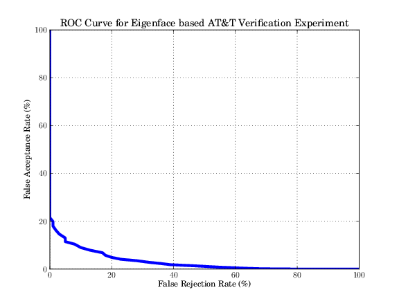
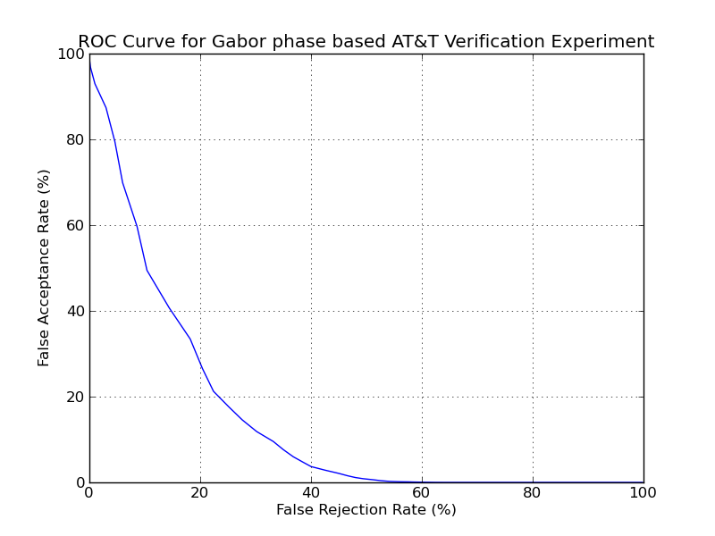
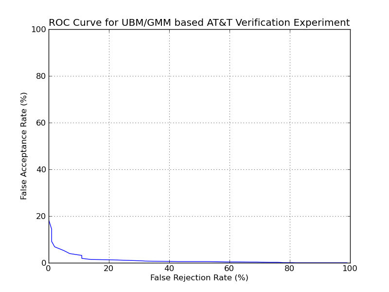

=====================
 Running the examples
=====================

To run the examples, just call the scripts from within the ``bin`` directory, 
e.g.:

.. code-block:: sh

  $ bin/eigenface.py
  
If you installed the image database in another folder than ``Database``, please
give this directrory as parameter to the script, e.g.:

.. code-block:: sh

  $ bin/eigenface.py <AT&T_DATABASE_DIR>

There are three example scripts:

.. code-block:: sh

  $ bin/eigenface.py
  $ bin/gabor_phase.py
  $ bin/dct_ubm.py

that perform more or less complicated face verification experiments. Each 
experiment creates an ROC curve that contains the final verification result of
the test. The generated files will be ``eigenface.png``, ``gabor_phase.png``, 
and ``dct_ubm.png``.

Since the complexity of the algorithms increase the expected execution time of 
them differ a lot. While the eigenface example should be finished in a couple of
seconds, the Gabor phase example could take some minutes, and the UBM/GMM model
needs in the order of half an hour to compute.

The eigenface example
~~~~~~~~~~~~~~~~~~~~~
The eigenface example follows the work-flow that is presented in the original
paper *Eigenfaces for Recognition* [TP91]_ by Turk and Pentland. First, it 
creates an object to query the database:

.. code-block:: python

  >>> atnt_db = bob.db.atnt.Database()
  
For training the projection matrix, the training images need to be read:

.. code-block:: python

  >>> training_image_files = atnt_db.files(groups = 'train', ...)
  >>> for filename in training_image_files.values():
  ...   training_image = bob.io.load(filename)
  
Since the images are already aligned to the eye positions, they can simply be
linearized (converted into one long vector) and put into an ``bob.io.ArraySet``:

.. code-block:: python

  >>> training_set = bob.io.Arrayset()
  >>> for image in training_images.values():
  ...  training_set.append(image.flatten())

which is used to train a ``bob.machine.LinearMachine``:

.. code-block:: python

  >>> pca_trainer = bob.trainer.SVDPCATrainer()
  >>> pca_machine, eigen_values = pca_trainer.train(training_set)

For some distance functions, the eigenvalues are needed, but in our example we
just ignore them.

After training, the model and probe images are loaded, linearized, and projected
into the eigenspace using the trained ``pca_machine``:

.. code-block:: python

  >>> model_image_files = atnt_db.files(groups = 'test', purpose = 'enrol', ...)
  >>> for filename in model_image_files.values():
  ...   model_image = bob.io.load(filename)
  ...   model_feature = pca_machine(model_image.flatten())

  >>> probe_image_files = atnt_db.files(groups = 'test', purpose = 'probe', ...)
  >>> for filename in probe_image_files.values():
  ...   probe_image = bob.io.load(filename)
  ...   probe_feature = pca_machine(probe_image.flatten())

To compute the verification result, each model feature is compared to each probe
feature by computing the Euclidean distance:

.. code-block:: python

  >>> for model_feature in model_features:
  ...  for probe_feature in probe_features:
  ...    score = bob.math.euclidean_distance(model_feature, probe_feature)

The results are divided into a list of positive scores (model and probe are from
the same identity) and a a list of negative scores (identities of model and
probe differ). Using these lists, the ROC curve is plotted:

.. code-block:: python

  >>> bob.measure.plot.roc(negatives, positives)
  

and the performance is computed:

.. code-block:: python

  >>> threshold = bob.measure.eer_threshold(negatives, positives)
  >>> FAR, FRR = bob.measure.farfrr(negatives, positives, threshold)

The expected result is: FAR 83.6% and FRR 83.6% at distance threshold 2048.9

.. note::

  Computing eigenfaces with such a low amount of training data is usually not an 
  excellent idea. Hence, the performance in this example is extremely poor.

Gabor jet comparisons
~~~~~~~~~~~~~~~~~~~~~
Description of algorithm will follow. The expected output is:

The expected result is: FAR 22% and FRR 22% at distance threshold 0.1799

The UBM/GMM modeling of DCT Blocks
~~~~~~~~~~~~~~~~~~~~~~~~~~~~~~~~~~
Description of algorithm will follow. The expected output is:

The expected result is: FAR 5% and FRR 5% at distance threshold 7640.9

.. [TP91] Matthew Turk and Alex Pentland. Eigenfaces for recognition. Journal of Cognitive Neuroscience, 3(1):71-86, 1991. 

